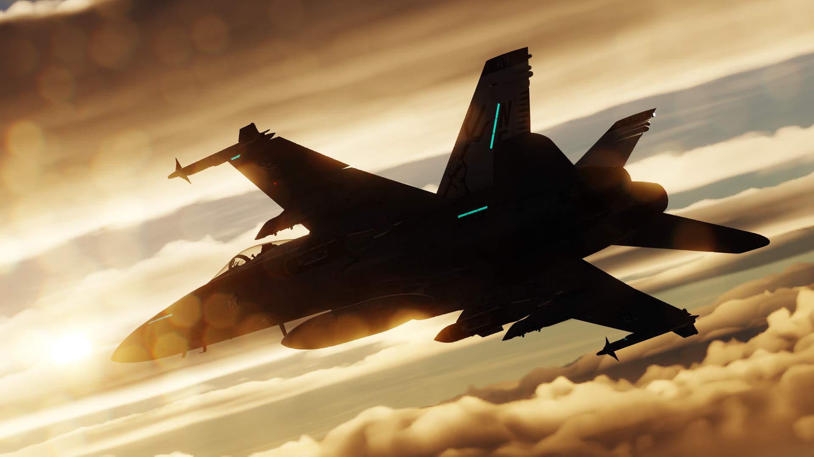
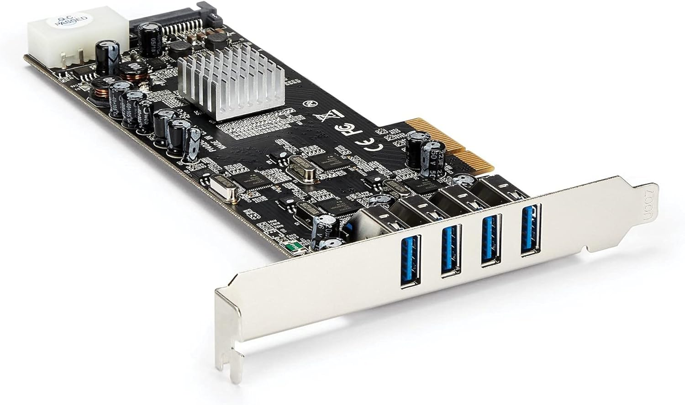
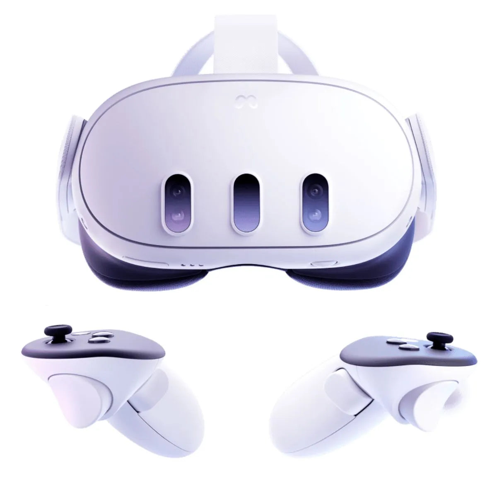
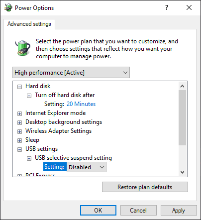
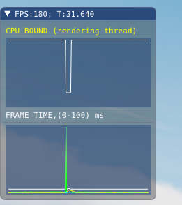
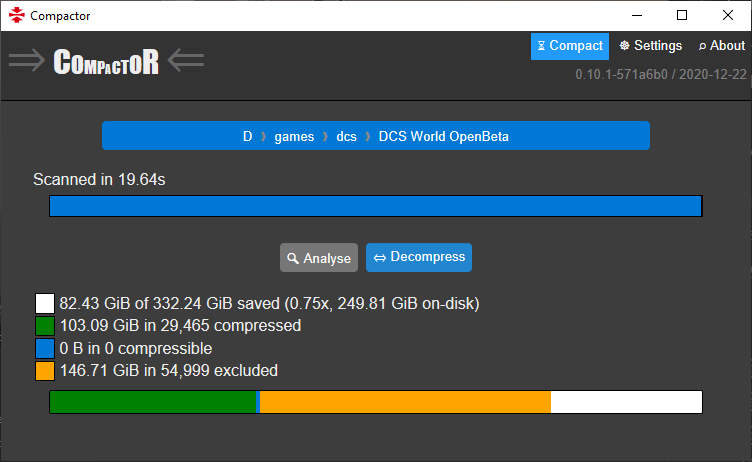
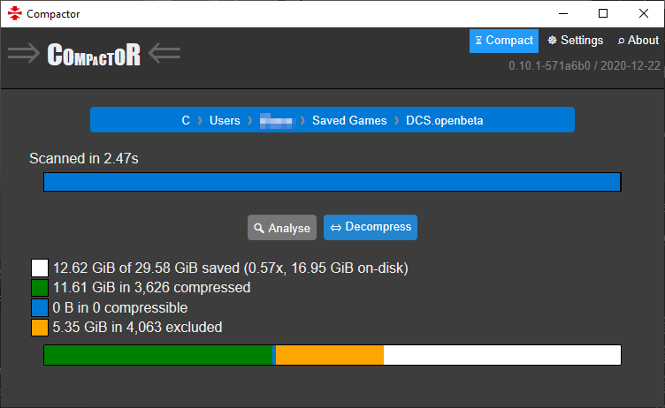

_Photo by Generic (@generic_dcs)_

# Recommended Specs

## Storage

You **MUST** install DCS on an SSD (solid state) instead of an HDD (spinning disk). The base game is 160GB and a large install is 700GB+. A dedicated 1TB or larger high performance SSD is recommended.

[Tom's Hardware: Best SSDs](https://www.tomshardware.com/reviews/best-ssds,3891.html)

An SSD is **absolutely essential**. When installed on a spinning disk, DCS can take over 20 minutes to load into a mission and may crash during loading or during gameplay.

## CPU

The best CPUs for DCS World are the AMD 7800X3D, AMD 5800X3D and AMD 5700X3D. But any fast gaming-oriented CPU is fine.

[Gamer's Nexus: Best CPUs of 2023](https://gamersnexus.net/cpus/best-cpus-2023-intel-vs-amd-gaming-video-editing-budget-biggest-disappointment)

DCS primarily uses two CPU cores and makes heavy use of the CPU’s cache. Some higher-end CPUs designed for heavily multithreaded applications, such as the AMD 7950X3D, AMD’s Threadripper series, and Intel’s Core i7 and i9 series, don’t offer much, if any, performance benefit to DCS. If you’re building a computer specifically for DCS, you’re better off getting a great gaming CPU rather than a top-end productivity-oriented CPU. Spend the money saved on a better GPU, a nice HOTAS or a head tracker!

Ideally, use an upgraded CPU cooler.

[Gamers Nexus: CPU Cooler Benchmarks](https://gamersnexus.net/megacharts/cpu-coolers)

## RAM

DCS World requires 16GB+ RAM minimum. 32GB-128GB RAM is recommended for large multiplayer servers and the Syria map.

For new builds, I strongly recommend 32GB of RAM as a bare minimum.

## GPU

The best GPUs for DCS World are high-end Nvidia and AMD GPUs. Intel GPUs are accepted for 1080p at lower settings.

Since DCS uses an older graphics engine, high amounts of VRAM is more important than ray tracing performance. 12-16GB+ of VRAM is ideal.

[Gamers Nexus: Best & Worst GPUs of 2023](https://gamersnexus.net/gpus/best-worst-gpus-2023-gaming-100-2000-video-cards)

[Tom's Hardware: Best Graphics Cards for Gaming](https://gamersnexus.net/gpus/best-worst-gpus-2023-gaming-100-2000-video-cards)

## PSU

You should have a sufficient power supply for your CPU and GPU— Tier B or better on the [Cultist Tier List](https://cultists.network/140/psu-tier-list/).

[PSU Tier List rev. 17.0g - Cultists Network](https://cultists.network/140/psu-tier-list/)

## USB


Some USB devices such as HOTASes may exhibit jitter or other issues when connected directly to a computer’s USB power. This is especially a problem with the Saitek/Logitech X52, X55 and X56. In many cases, this can be resolved using a powered USB hub. I’ve personally found powered USB hubs from SABRENT to be good quality for the price. Some of these hubs also have individual switches for each port, which is handy for quickly disconnecting your flight sim devices to play other games where those devices cause problems (looking at you, *Elden Ring*).



Your motherboard has a limited number of USB devices and limited amount of USB bandwidth it can support. Flight simulator devices can push past these limits, especially when using some of the more advanced head trackers/webcams, VR headsets, and USB displays. If you notice these devices having issues, try adding a USB PCIe expansion card to your system and moving some devices to the expansion card. 

Note that the 4-port and 7-port expansion cards typically have the same bandwidth and device count limits. Also note that you should purchase a reputable card with an independent USB controller. Cheaper cards are just internal hubs and won’t solve this issue, and in the worst case can cause system instability.

# Head Tracking

A head tracker is ideal for anyone who is not using VR. It is almost essential equipment for dogfighting- possibly more important than a HOTAS. Some great options:

- [TrackHat Sensor V2](https://www.trackhat.org/sensorv2): Infrared camera based sensor. *Author’s personal favorite - better tracking than IRLED trackers in their experience.*
- [DelanClip](https://delanengineering.com/), [GrassMonkey](https://grassmonkeysimulations.com/), [TrackNP](https://www.aliexpress.com/w/wholesale-tracknp.html): Infrared LED based sensors. Good precision and relatively affordable.
- [JBC Head Tracker](https://jbcconsulting448679429.wordpress.com/), [SmoothTrack](https://smoothtrack.app/): Smartphone apps. Basic, but very affordable if you already have a phone with face unlock. JBC has a free trial and is $2 to unlock the full version. SmoothTrack is $10 and has more features specific to Apple devices, such as using AirPods for tracking. Both the Apple and Android app stores have refund policies.
- [OpenTrack Neuralnet](https://github.com/opentrack/opentrack/wiki/AI-Face-Tracking): Standard webcam based sensor. Basic, but very affordable if you already have a webcam or can purchase one inexpensively.

I do not recommend:

- NaturalPoint TrackIR: Too expensive compared to competition. Fragile infrared light clip. Lower refresh rates than competition. Official software has not been updated in a long time, compared to OpenTrack receiving new quality of life features.
- Tobii eye trackers. The head tracking is too coarse and oversmoothed for flight simulation. A real-life friend who tried to use one for flight simulation described it as feeling drunk.

# Virtual Reality

> ⚠️ Don’t bother with DCS VR unless:
> 1. You have a very high end PC
> 2. You are willing and able to troubleshoot all manner of obscure technical issues
> 3. You are comfortable installing software from GitHub and very carefully reading technical instructions written by software engineers
> 4. You have a head tracker to fall back on when updates break VR support from time to time

There are no perfect VR headsets, but there are a few worth consideration for DCS:

## [Meta Quest 3](https://www.meta.com/quest/quest-3/)



**Pros**|
-|
Relatively affordable
Easiest to configure for PC use
Good warranty with easy returns/exchanges
Also good for roomscale
Includes controllers

**Cons**|
-|
Requires either excellent/dedicated wifi equipment or a third party charging+link cable for long sessions
Display is OK but not perfect
Significant compression artifacts including image noise and color banding
Mandatory Oculus/Meta software updates sometimes cause breaking issues
No eye tracking

## [Pimax Crystal](https://pimax.com/crystal/)


**Pros**|
-|
Excellent display
Excellent eye tracking
Available with or without controllers

**Cons**|
-|
Expensive
Large & heavy
Complicated software
Lower quality of customer support
Poor for roomscale
Poor head tracking
Controllers have poor tracking

## [Bigscreen Beyond](https://store.bigscreenvr.com/products/bigscreen-beyond)


**Pros**|
-|
Excellent display
Lightweight & compact
Custom fitted for maximum comfort
High quality customer support
Best microphone

**Cons**|
-|
Expensive
No eye tracking
IPD is not user adjustable - cannot share headset with someone who has a different IPD
Each user needs a separate custom fitted faceplate
High restocking fee once the custom fitted parts are made
No controllers available - roomscale requires controllers and lighthouses from another brand
Not compatible with eyeglasses - users with vision deficiency will need prescription inserts

## Why not…?

### Meta Quest Pro

- The Quest 3 is both cheaper and higher resolution.
- On Meta headsets, eye tracking with OpenXR is only available in debug mode. This requires a developer account, which must be verified by Meta. *The author had to send their driver’s license to Meta to pass verification. Your experience may vary.*
- The eye tracking on the Quest Pro is not as good as the Pimax Crystal when used with PC VR. It lags behind your gaze by a few frames. *The author finds this noticeable but tolerable. Your experience may vary.*
- Some users report eye & face tracking hardware failure due to sweat/moisture.
- The slightly better controllers on the Quest Pro compared to the Quest 3 are of limited use for stationary simulations.
- There are *some* advantages - good comfort, ability to see your HOTAS and keyboard through the gap between the headset and your face, and the included controllers are great for roomscale games. But the advantages aren’t worth the tradeoffs for most people, given this price point.
- Awkward middle child between the Quest 3 and Crystal.

### HP Reverb G2

- Microsoft is killing off Windows Mixed Reality, and the G2 relies on WMR to function.
- There is some hope that [Monado](https://monado.freedesktop.org/) will provide support after WMR is removed, but this is not guaranteed.
- Very common hardware failures due to internal damage to the proprietary video cable.

### Valve Index

- The Index is severely outdated hardware, and overpriced compared to the Meta Quest 3.

### Apple Vision Pro

- Not compatible with OpenXR, which is required for DCS.

# Windows Settings and Tweaks

## General Tweaks

If you are running an Intel [Alder Lake](https://en.wikipedia.org/wiki/Alder_Lake) CPU or AMD [Ryzen 7000](https://en.wikipedia.org/wiki/List_of_AMD_Ryzen_processors#Ryzen_7000_series) Series CPU or newer, upgrade to Windows 11 to use the new Thread Director.

Install any available Windows updates.

If your system supports [Resizable BAR](https://www.intel.com/content/www/us/en/support/articles/000090831/graphics.html) and/or [Smart Access Memory](https://www.amd.com/en/technologies/smart-access-memory), enable it.

Close any unnecessary programs and browser tabs when playing DCS.

Uninstall all bloatware packaged by the manufacturer of your computer.

Disable any VPN software when playing DCS multiplayer.

## Intel CPU Tweaks

Be sure to enable XMP in your motherboard settings if your RAM supports it!

## Nvidia GPU Tweaks

Update your graphics drivers to the latest available version from [nvidia.com/drivers](https://nvidia.com/drivers). If you are running an outdated driver version, some options like DLSS and SSS may be grayed out in the in-game options.

Disable Hardware Accelerated GPU Scheduling in Windows settings. It increases input latency and stutter, especially on mid to high end systems when using VR.

## AMD CPU Tweaks

If you have an AMD Ryzen 7000 Series or newer CPU, install the [Xbox Game Bar](https://apps.microsoft.com/store/detail/xbox-game-bar/9NZKPSTSNW4P) and run it while playing games. AMD’s software uses it to detect when a game is running and change CPU scheduling behavior.

If you have an upgraded CPU cooler, use [Ryzen Master](https://www.amd.com/en/technologies/ryzen-master) to overclock your CPU.

Be sure to enable DOCP/EOCP in your motherboard settings if your RAM supports it! *I measured a 13% CPU performance gain in 3DMark toggling it on and off on my AMD system.*

## AMD GPU Tweaks

In the AMD Software, navigate to Preferences, and next to AMD User Experience Program, click Learn More and then Leave. If left enabled, this setting runs a telemetry service on your computer. *I found this service was consuming a lot of system resources and making my system generally sluggish on boot. Leaving the program made my computer substantially snappier and my applications started much faster.*

## Exclude DCS from Microsoft Defender Antivirus

Real-time antivirus scans can reduce performance for programs that need to read many files from disk during runtime. You can disable real-time scans of files that DCS accesses while DCS is open. The files will still be scanned by regular scheduled scans when DCS is not running.

> ⚠️ If you use mods or play multiplayer, this tweak increases your risk. Use your best judgement about whether to use this tweak. I personally wouldn’t use this with any mod for which I haven’t read the source code. If you use the [3D Editor for DCS Web Editor](https://dcs-web-editor.github.io/dcs-web-editor-docs/editor/3deditor/), this also increases your vulnerability to malicious scripts in mission files.

For the default Microsoft Defender antivirus:

1. Open the Windows Security application
2. Select Virus & Threat Protection in the sidebar
3. Under Virus & Threat Protection settings, click Manage Settings
4. Under Exclusions, click Add or Remove Exclusions
5. Add a File Exclusion for **the full path** to `DCS.exe`, e.g. on my system it is `D:\games\dcs\DCS World OpenBeta\bin-mt\DCS.exe`
6. Add a Process Exclusion for **the full path** to `DCS.exe`, e.g. on my system it is `D:\games\dcs\DCS World OpenBeta\bin-mt\DCS.exe`

Here is what mine looked like after this. Yours will look differently.


## Set Page File Size

The [page file](https://learn.microsoft.com/en-us/troubleshoot/windows-client/performance/introduction-to-the-page-file) is used by Windows for infrequently accessed data that would otherwise consume RAM. **For most users, the default setting is fine.** However, some users have found that manually setting the page file size improves performance. This is especially useful if your PC contains multiple types of storage with different speeds, such as both SSDs and HDDs. It’s also useful if you don’t have a lot of free space on your page file’s drive, to help Windows plan better with the limited space.



> 💡 Reboot your PC after changing page file settings.

## Disable USB Selective Suspend

[USB selective suspend](https://learn.microsoft.com/en-us/windows-hardware/drivers/usbcon/usb-selective-suspend) is a feature intended to reduce electricity usage by powering down idle devices. This can cause problems for flight simulators, such as disconnecting your peripherals during a long cruise, or in some cases, causing devices like head trackers to stop working after a few minutes of use. 

Disable this setting:

1. Press the `⊞ Win` key to open the start menu, and type “edit power plan”. Click the result that leads to the Control Panel.
2. In the Edit Plan Settings page that appears, click “Change advanced power settings”
3. In the Power Options window that appears, navigate to “USB selective suspend setting” and choose “Disabled” from the dropdown



# Game Tweaks

## Enable Multithreading

Use the multithreading build of the game for significantly improved performance.

For the Steam version, right click on *DCS World Steam Edition* and select play. Select “Play MT Preview” and then press Play.


The Standalone version *should* automatically use multithreading by default.

## Enable the Frame Rate Counter

While playing the game, press `RCtrl + Pause` to open a frame rate counter widget. You can use this to check your current framerate and whether you are currently CPU bound or GPU bound. You can use this to measure the performance impact of settings and tweaks.



> 💡 There is a 180FPS limit by default.

> 💡 The CPU BOUND/GPU BOUND indicator is not accurate in all cases. To find out if you are CPU limited you must compare frame render time to framerate to determine if your GPU is rendering frames faster than the framerate.

> 💡 Frame times may be inaccurate in VR if OpenXR’s Turbo Mode is enabled.

## Recompile Shaders

Every time that DCS World is updated, your graphics driver is updated, or you change your graphics card, you should delete the following directories in your [Saved Games folder](#saved-games-folder):

`<Saved Games folder>\fxo`

`<Saved Games folder>\metashaders2`

These folders contain [shaders](https://en.wikipedia.org/wiki/Shader), which need to be rebuilt whenever either the game or graphics card driver is updated. DCS does not seem to consistently automatically rebuild these, resulting in performance issues. Deleting the folders will force DCS to rebuild them; this may cause a one-time increase in load times or some stutter during gameplay, but these will only happen once for each shader and the game may run smoother afterwards.

Learn more about shader compilation:



## Disable Data Exports

If you use data exports such as TacView, Winwing’s SimAppPro, DCS-BIOS etc. You should disable these when playing large missions. These export a large amount of data from DCS on every frame, contributing to slowdown.

One way to disable data exports is to edit the `Export.lua` script within your [Saved Games folder](#saved-games-folder). Open `<Saved Games folder>\Scripts\Export.lua` in a text editor. Add two hyphens (`--`) in front of a line to disable that line. For example, my `Export.lua` contains lines for TacView, DCS-BIOS and SRS:

```lua
local Tacviewlfs=require('lfs');dofile(Tacviewlfs.writedir()..'Scripts/TacviewGameExport.lua')
dofile(lfs.writedir()..[[Scripts\DCS-BIOS\BIOS.lua]])

pcall(function() local dcsSr=require('lfs');dofile(dcsSr.writedir()..[[Mods\Services\DCS-SRS\Scripts\DCS-SimpleRadioStandalone.lua]]); end,nil)
```

I can disable TacView and DCS-BIOS as such:

```lua
--local Tacviewlfs=require('lfs');dofile(Tacviewlfs.writedir()..'Scripts/TacviewGameExport.lua')
--dofile(lfs.writedir()..[[Scripts\DCS-BIOS\BIOS.lua]])

pcall(function() local dcsSr=require('lfs');dofile(dcsSr.writedir()..[[Mods\Services\DCS-SRS\Scripts\DCS-SimpleRadioStandalone.lua]]); end,nil)
```

To reverse this change, remove the hyphens you added.

## Reduce Disk Usage

Certain SSDs have reduced write performance when close to full because the size of dynamic SLC cache decreases on a full drive. Depending on the model of SSD, you should keep free space at around 25%. This number may change depending on if the SSD is overprovisioned or has DRAM cache.

### Periodically Delete Tracks

Every so often, delete Track files from your [Saved Games folder](#saved-games-folder) to free up disk space. You can find `.trk` files in `<Saved Games folder>Tracks\Multiplayer`.

If you use Tacview, also delete old `.acmi` files in `%userprofile%\Documents\Tacview`.

### Compress Game Files

This tweak doesn’t improve in-game performance, but can save disk space and doesn’t hurt performance. Download [Compactor](https://github.com/Freaky/Compactor) and use it to compress the DCS World game directory and the [Saved Games folder](#saved-games-folder). The compression algorithm it uses is built into Windows and has virtually zero performance impact on CPUs made after 2010. On my computer, this shrunk DCS World’s disk usage by over 110GB with no in-game performance impact.





## Shrink Kneeboard Pages

Very large kneeboard pages can cause a performance impact. Use image editing software to scale your kneeboard pages down to the resolution of your display. [OpenKneeboard’s guide to sizing](https://openkneeboard.com/faq.html#how-do-i-get-the-best-visual-quality-or-the-most-readable-text) has useful tips for both VR and 2D.

# VR Tweaks

If you use a Virtual Reality headset, there are some additional tweaks and considerations.

## Drivers

If you have an Nvidia graphics card, install the latest drivers.

AMD drivers have historically had unstable VR performance between versions; the best performance may or may not be the latest driver. As of January 2024, the RX 6000 series works well on the latest driver, while the RX 7000 series is sometimes hit or miss for different people.

## Prefer Standalone Over Steam

For some reason I haven’t determined, DCS VR runs significantly worse when run through Steam than as a standalone application. For best performance, run the Standalone version of DCS directly, and don’t launch it through Steam.

To convert an existing Steam installation to Standalone:

1. [Download and run the standalone installer](https://www.digitalcombatsimulator.com/en/downloads/world/)
2. Untick "download" at the end of the setup wizard
3. Manually copy or move your files from the Steam installation to the Standalone installation
4. Delete `<DCS standalone installation folder>\Config\retail.cfg`
5. Run the “Repair DCS World” application in your Start Menu

## OpenXR Toolkit

[OpenXR Toolkit](https://mbucchia.github.io/OpenXR-Toolkit/) provides tweaks for VR applications. Some notable settings:

- Turbo Mode, which makes VR feel smoother by forcing frames to render more quickly rather than wait for consistent frame timing. Note that this seems to cause weird, unexplained problems when combined with SteamVR.
- The supersampling in OpenXR toolkit works better than the supersampling built into DCS.

After it’s installed, you can open the toolkit menu while playing and tweak settings. See [the usage instructions](https://mbucchia.github.io/OpenXR-Toolkit/#basic-usage) and [feature list](https://mbucchia.github.io/OpenXR-Toolkit/features.html) for more info.

## Quad Views Rendering

[Quad Views Rendering](https://github.com/mbucchia/Quad-Views-Foveated/wiki/What-is-Quad-Views-rendering%3F) is a technique that renders the focus area within your headset at a higher resolution than the rest of the headset. If your headset has eye-tracking, the high-resolution render area will follow your gaze; otherwise, it will be centered within your headset.


This can hugely reduce the number of pixels needed to render, improving performance. However, in a combat flight simulator it can also cause problems tracking small, fast moving objects outside of the focus area, such as a dogfight opponent, tracer fire, or the lights on the carrier during a night trap. It may require some tuning and user preference. Results may vary depending on the specific headset and the user’s vision and preferences. If your system is CPU bottlenecked, this might decrease your performance overall.

To try this, use both [Quad Views Foveated](https://github.com/mbucchia/Quad-Views-Foveated) and [Quad Views Companion](https://github.com/TallyMouse/QuadViewsCompanion). The former implements the feature, and the latter provides a GUI for changing the settings.


My preferred settings for an HP Reverb G2 - yours will be different, because you have a different computer, headset and eyes!

Note that if you choose to use both Quad Views Rendering and OpenXR Toolkit together, you should set settings like Turbo Mode and foveated rendering/render scale in QuadViewsCompanion and leave them at the default setting in OpenXR Toolkit.

RedKite has a good video demoing eye-tracked Foveated Rendering:



*Note: If you are using a Meta Quest Pro, you’ll need to install [OpenXR Eye Trackers](https://github.com/mbucchia/OpenXR-Eye-Trackers/wiki/Meta-Quest-Pro) to enable eye tracking on PC. You will probably need a verified Developer account.*

## Meta Quest Link Cable

If you have a Meta Quest headset, a link cable will provide the best video quality. Meta sells an [official link cable](https://www.meta.com/quest/accessories/link-cable/) if you don’t have one, and more affordable third-party cables are also available.

A tradeoff is that you may not be able to charge your headset and use the link cable at the same time, which may limit how long you can fly at a time. [This third party cable](https://a.co/d/765REiP) allows connecting both a charger and link at once, which extends battery life sufficiently for very long flights.

## DLSS/FSR

DLSS doesn’t work great in VR headsets, causing noticeable ghosting. The main use case of DLSS with VR is to supersample in OpenXR, then use DLSS to scale back down to the native resolution. This can soften some types of distracting visual artifacts, but requires a very beastly rig.

FSR also causes visual artifacts, such as ghosting/blurring on moving options and when switching MFD pages. Personally, I find the performance gain to be worth the tradeoff, but your mileage may vary based on your headset and vision.

## XRNeckSafer

If you find it uncomfortable or painful to twist your torso and neck to look behind you/over your wing, you can use [XRNeckSafer](https://gitlab.com/NobiWan/xrnecksafer) to provide an assist.

## Separate Profiles for 2D and VR

If you play in both 2D and VR, you can set up some tweaks to make switching between them easier.

Create two separate shortcuts for DCS, one for 2D and one for VR. For 2D:

`"D:\games\dcs\DCS World OpenBeta\bin-mt\DCS.exe" --force_disable_VR`

For VR:

`"D:\games\dcs\DCS World OpenBeta\bin-mt\DCS.exe" --force_enable_VR`

Additionally, you can save custom graphical settings into three different slots in the Options > System tab, using the presets buttons in the bottom right. You can use one for your 2D settings and another for your VR settings.

You can then manually switch between these presets, or use [SkateZilla’s launcher](https://forum.dcs.world/topic/134493-the-dcs-updater-launcher-gui-utility-version-20-2023/) to automatically launch using one or the other.

## Asynchronous Space Warp

[Asynchronous Space Warp](https://developer.oculus.com/blog/asynchronous-spacewarp/) (ASW) is a technology that improves perceived smoothness in VR, at the tradeoff of locking the framerate to an integer divisor of the headset’s refresh rate. This feature is great if you can maintain your headset’s refresh rate. However, if your framerate dips below the refresh rate even slightly, it will immediately drop to 1/2 the refresh rate. It can also cause judder when using helmet-mounted displays.

On Meta Quest headsets, you can toggle ASW while playing with these keys:

| Keybind | ASW | Framerate |
| --- | --- | --- |
| Ctrl+Num1 | Disabled | Unlocked |
| Ctrl+Num2 | Disabled | Locked |
| Ctrl+Num3 | Enabled | Locked |
| Ctrl+Num4 | Auto | Unlocked |

> ℹ️ My personal preference is AWS disabled and framerate unlocked (Ctrl+Num1)

# Suggested Game Settings

These settings are a good starting baseline; you may need to tweak and test further, especially for VR setups.

## Audio

| | |
|-|-|
| Music | 0% (Only effects main menu, not in-game scripted music) |
| Hear like in Helmet | Enabled |

## System

| | |
|-|-|
| Res of Cockpit Displays | 1024 Every Frame |
| Anti-Aliasing | Off or MSAA 2x/MSAA 4x
Do not use TAA - it causes ghosting
Do not use DLAA - it causes blurring
MSAA may reduce shimmer in VR |
| Upscaling | Off has best fidelity (no blurring/ghosting), especially on 1080p monitors
Try DLSS Quality and sharpening 0.5 on newer Nvidia graphics
Try FSR with scaling 0.9 and sharpening 0.8 on AMD graphics or older Nvidia graphics
Tune sharpening to user preference
If this is grayed out, verify you are using the multi-threaded build, turn off anti-aliasing and verify drivers are fully updated |
| Textures | High |
| Terrain textures | High |
| Heat Blur | High (2D) or Off (VR)
In VR, the blur renders incorrectly, causing it to blur objects in front of the heat. |
| Shadows | Off or High |
| Flat Shadows Blur | Off |
| Secondary Shadows | User preference
Particularly impactful on carriers and at large airbases |
| SSS (Screen Space Shadows) | User preference |
| Visib Range | Medium or High |
| Civ Traffic | Off |
| Clouds | High or Ultra |
| Depth of Field | Off
Causes artifacting in VR when using Quad Views Rendering |
| Water | Medium |
| SSAO | Off
Causes artifacting in VR when using Quad Views Rendering |
| SSLR | Off
Causes artifacting in VR when using Quad Views Rendering |
| Lens Effects | Off
Causes artifacting in VR when using Quad Views Rendering |
| Motion Blur | Off
Causes artifacting in both 2D and VR |
| Clutter/Grass | 0 |
| Forest Visibility | 100% |
| Forest Details Factor | 1 |
| Scenery Details factor | 1 |
| Preload Radius | Start at 2000 for every GB of RAM in your system. If the game runs fine, double it and test again. Tune upwards if you experience moderate stutter when flying. Tune downwards if you have excessive RAM usage or periods of freezing/heavy stutter. |
| Chimney Smoke Density | 0 |
| LOD Switch Factor | No lower than 1.0. Increase on higher end systems to reduce “pop-in” of low detail models. Particularly noticeable on larger objects like ships, less noticeable on smaller objects like cars. |
| Anisotropic Filtering | 16x |
| Terrain Objects Shadows | Flat or Default (Default matches Shadows setting) |
| Cockpit Global Illumination | On |
| Rain droplets | Enabled |

## Gameplay

| | |
|-|-|
| Game Flight Mode | Disabled (Breaks the entire game!) |
| Easy Communication | Disabled (Breaks missions) |
| G-Effects | None (User preference, but the effect is probably too aggressive while AI are not effected at all) |
| Birds | 0 (Causes random engine failures at low altitudes) |

## Misc

| | |
|-|-|
| Force Feedback | Disabled (unless you have Force Feedback hardware) |
| Random System Failures | Disabled |

## VR

| | |
|-|-|
| Pixel Density | 1.0 (If you want to enable supersampling, configure it in your headset’s software or Quad Views instead.) |
| Force IPD Distance | Off (This configures world scale, which should be set in OpenXR Toolkit instead: https://mbucchia.github.io/OpenXR-Toolkit/other-features.html#world-scale-override) |
| Bloom effect | Off (causes artifacting when using foveated rendering) |
| Enable HMD Mask | On unless you are livestreaming |
| MSAA Mask Size | If set to a value below 1.0, MSAA will only be applied to the center of the display. Some users report that setting this to values other than 1.0 caused issues. |
| VR Mirror Use DCS System Resolution | On. Turning this off decreases performance and interferes with Jester features in Heatblur modules. Use external software such as Oculus Mirror Utility for recording/livestreaming. |

# Troubleshooting Crashes

## Logs

There is a log file located in the [Saved Games folder](#saved-games-folder) at `<Saved Games folder>\Logs\dcs.log`. It can sometimes provide clues for why DCS has crashed, but can be difficult to interpret.

## Sanity checks

These are some basic steps that have been known to fix crashes for some users in the past.

### Recompile Shaders

Follow the steps in the Recompile Shaders section above to clear the shader cache.

### Remove all mods

Mods in DCS can cause bizarre, seemingly unrelated issues. Reflected of Reflected Simulations has documented some of the utterly strange bugs that can be caused simply by having a mod installed.



As a troubleshooting step, remove all mods from your DCS installation. (Liveries and kneeboard pages are OK. Sound mods, modded aircraft and other assets should be removed.)

### Repair DCS

Follow the instructions on [how to cleanup and repair DCS](https://www.digitalcombatsimulator.com/en/support/faq/repair/). This will reset your game folder to default.

### Rename Saved Games Folder

Occasionally, something in the [Saved Games folder](#saved-games-folder) triggers problems in DCS. *I personally had this problem with F-15E Strike Eagle crashing when it came out, and this fixed the issue for me.*

Rename the Saved Games folder to `%userprofile%/Saved Games/DCS.backup`, then launch DCS. It will reset all of your settings including graphics settings, controls, player profiles, etc. to default. If this fixes your crash, you can then copy the files from the backup back into the Saved Games folder a piece at a time (or reconfigure the game from scratch).

### Test Memory with Memtest86+

Use [Memtest86+](https://www.memtest.org/) to test your system's memory overnight.

# Saved Games Folder

Some steps above reference the “Saved Games folder”, which is located in the following places:

- If you play on Steam, it is `%userprofile%\Saved Games\DCS`
- If you play on Standalone version, it is `%userprofile%\Saved Games\DCS`...
    - …unless you upgraded from an Open Beta version prior to patch [2.9.3.51704](https://www.digitalcombatsimulator.com/en/news/changelog/stable/2.9.3.51704/), in which case it is `%userprofile%\Saved Games\DCS.Openbeta`, even after the Open Beta and Stable versions were unified.
